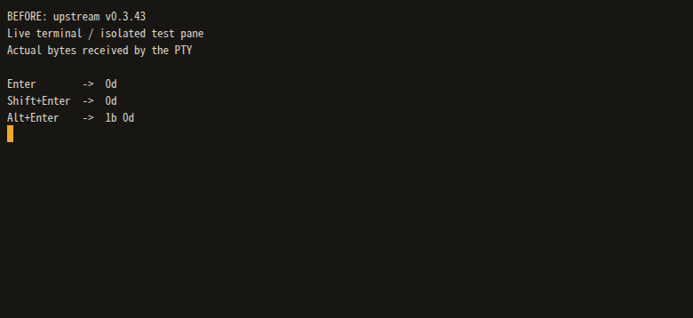
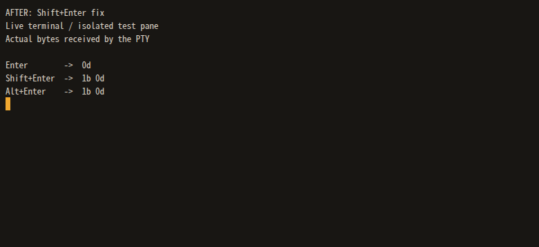

# Shift+Enter 재현 자료

`devswha/herdr-web-ui`의 Shift+Enter 수정 PR을 위한 별도 테스트 자료입니다.
소스 변경 브랜치와 분리하여 보관합니다.

실제 브라우저에서 Enter, Shift+Enter, Alt+Enter를 순서대로 누른 뒤,
별도 테스트 터미널의 raw-mode 프로세스가 받은 바이트를 캡처했습니다.
WebSocket 입력 프레임과 PTY 수신 바이트가 일치하는지도 확인했습니다.

## 수정 전: 원본 v0.3.43 / 1608cce

## 수정 후: 31b5569

`0d`는 CR이며, `1b 0d`는 ESC + CR입니다.
수정 후에는 Shift+Enter가 기존 Alt+Enter와 같은 시퀀스를 전송합니다.

검증 명령과 결과, 원본에서도 재현한 통합 테스트 실패는 [validation.txt](validation.txt)에 정리했습니다.
